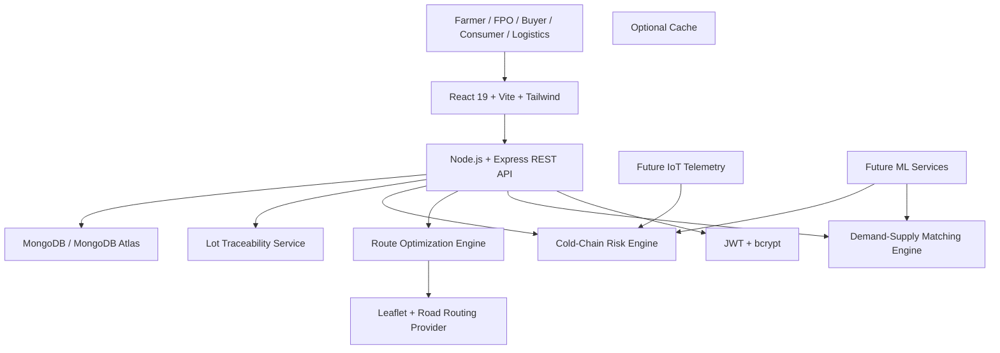

# 🌾 Product Requirements Document (PRD)

## Project Name: KisanDirect (किसानडायरेक्ट)

**Theme:** Smart India Hackathon (SIH 2026) — Agriculture, FoodTech & Rural Logistics  
**Document Version:** 2.0.0  
**Status:** SIH Prototype / Demo-Ready Specification  
**Target Platform:** Web (Desktop + Mobile Responsive)  
**Primary Languages:** English (`en`) & Hindi (`hi`)

---

# 1. Executive Summary

## 1.1 Vision

KisanDirect is a **demand-driven farm aggregation and cold-chain orchestration platform** that connects farmers/FPOs with consumers and institutional buyers.

The platform combines:

- Farm-lot digitization
- Buyer demand and RFQ management
- Demand-to-supply matching
- FPO/collection-center aggregation
- Mandi price benchmarking
- Capacity-aware pickup planning
- Cold-chain risk monitoring
- Route optimization
- Lot traceability
- Order and payout lifecycle management

The goal is not to claim that every intermediary disappears. The goal is to **reduce unnecessary commission-based intermediation and make logistics, pricing and transaction costs transparent**.

## 1.2 Core Value Proposition

> **Demand → Farm Lots → FPO Aggregation → Optimized Pickup → Cold Chain → Traceable Delivery → Farmer Payout**

KisanDirect is designed around the operational gap between a buyer saying:

> "I need 1.5 tonnes of tomatoes tomorrow."

and multiple nearby farmers having:

> "500 kg + 400 kg + 600 kg available at different locations."

The platform converts these fragmented lots into a feasible procurement and logistics plan.

---

# 2. Problem Statement

## 2.1 Problems Faced by Farmers

1. Fragmented access to buyers.
2. Limited visibility into buyer demand.
3. Difficulty comparing offered prices with nearby market benchmarks.
4. Small individual quantities that are inefficient to transport.
5. Post-harvest deterioration during delayed or poorly planned movement.
6. Unclear logistics deductions and net realization.
7. Limited digital traceability of lots and transactions.
8. Difficulty managing institutional/bulk procurement.

## 2.2 Problems Faced by Buyers

1. Finding reliable farm/FPO supply.
2. Aggregating small quantities from multiple farms.
3. Maintaining quality and delivery time.
4. Planning cold-chain pickup routes.
5. Tracking shipment temperature and ETA.
6. Managing RFQs and recurring procurement.
7. Handling quality disputes and quantity mismatches.
8. Maintaining transaction and invoice records.

## 2.3 Problems Faced by Logistics Operators

1. Multiple farm locations.
2. Small and fragmented loads.
3. Empty or inefficient return trips.
4. Vehicle capacity constraints.
5. Delivery time windows.
6. Commodity-specific temperature requirements.
7. Road/travel-time uncertainty.
8. Need for route re-planning when a pickup is cancelled.

---

# 3. Product Goals

## 3.1 Primary Goals

- Enable farmers/FPOs to publish structured crop lots.
- Allow buyers to create demand/RFQs.
- Match buyer demand with suitable farm lots.
- Aggregate compatible lots through FPOs/collection points.
- Generate feasible pickup routes.
- Consider vehicle capacity and delivery constraints.
- Estimate cold-chain/spoilage risk.
- Provide lot-level traceability.
- Provide transparent farmer payout and logistics costs.
- Support Hindi and English.
- Provide a strong, explainable SIH demonstration.

## 3.2 Non-Goals for the Current Prototype

The prototype does **not** claim to provide:

- Universal live IoT telemetry.
- Guaranteed spoilage percentages.
- Universal 1.28 road-distance accuracy.
- Guaranteed real-time mandi data unless an authorized live source is connected.
- Production-grade banking/payment settlement.
- Universal GST/e-way bill filing.
- Fully autonomous ML route planning.
- Elimination of every intermediary in the agricultural ecosystem.

---

# 4. Target Users

| Persona | Role | Primary Need |
|---|---|---|
| Farmer | Individual grower | Sell lot at transparent price and receive payout |
| FPO Operator | Aggregator | Combine farmer lots and fulfill buyer demand |
| Consumer | Retail buyer | Purchase traceable farm produce |
| Institutional Buyer | Hotel, restaurant, retailer, processor | Procure predictable bulk supply |
| Logistics Operator | Reefer/fleet operator | Execute capacity- and time-feasible routes |
| Platform Admin | Operations | Verify users, resolve disputes and monitor system |

---

# 5. Product Architecture

KisanDirect consists of six major layers:

1. **Supply Layer** — Farmers/FPOs publish crop lots.
2. **Demand Layer** — Consumers and B2B buyers create purchase requirements.
3. **Matching Layer** — System matches demand with suitable lots.
4. **Aggregation Layer** — FPO/collection centers consolidate compatible produce.
5. **Logistics Layer** — Route engine creates capacity- and time-aware pickup plans.
6. **Trust Layer** — QR traceability, quality records, shipment telemetry, order lifecycle and payout records.

---

# 6. Core User Journey

## 6.1 B2B Example

### Step 1 — Buyer Creates Demand

Buyer requests:

- Commodity: Tomato
- Quantity: 1,500 kg
- Delivery date: Tomorrow
- Delivery window: 07:00–11:00
- Destination: Buyer depot
- Quality: Grade A/B
- Temperature requirement: Commodity-dependent

### Step 2 — Matching Engine

System searches nearby available lots:

- Farm A → 500 kg
- Farm B → 400 kg
- Farm C → 600 kg

Total:

**1,500 kg**

### Step 3 — Aggregation

The system groups compatible lots by:

- Commodity
- Variety
- Grade
- Harvest window
- Temperature requirement
- Geography
- Delivery deadline

### Step 4 — Vehicle Selection

System checks:

- Vehicle capacity
- Current load
- Pickup count
- Travel distance
- Delivery time window
- Commodity compatibility

### Step 5 — Route Generation

The route engine generates:

**Hub → Farm A → Farm B → Farm C → Buyer**

### Step 6 — Cold-Chain Monitoring

Shipment displays:

- Current temperature
- Target temperature range
- ETA
- Transit duration
- Temperature-risk status

If actual IoT hardware is not connected, the interface must explicitly show:

> **SIMULATED REEFER TELEMETRY**

### Step 7 — Delivery

At delivery:

- Quantity verified
- Quality checked
- QR lot scanned
- Buyer confirms receipt
- Farmer/FPO payout status updated

---

# 7. Functional Modules

## 7.1 Authentication & RBAC

### Roles

- `farmer`
- `fpo`
- `consumer`
- `buyer`
- `logistics`
- `admin`

### Features

- Mobile/email authentication
- Password hashing
- JWT session management
- Role-based routing
- Demo credentials for SIH
- OTP simulation for prototype
- User verification status

### Verification Model

Production-ready architecture should support:

- Farmer identity/KYC verification
- FPO registration verification
- Buyer GST/business verification
- Bank-account verification
- Admin review status

---

# 8. Farmer & FPO Dashboard

Route:

`/farmer/dashboard`

## 8.1 Lot Creation

Fields:

- Crop name
- Variety
- Category
- Quantity
- Unit
- Asking price
- Harvest date/time
- Ready-for-pickup time
- Farm location
- Expected shelf life
- Quality grade
- Optional certification
- Preferred buyer type

## 8.2 Lot Status

Possible states:

```text
DRAFT
PUBLISHED
MATCHED
RESERVED
PICKUP_SCHEDULED
IN_TRANSIT
DELIVERED
QUALITY_CONFIRMED
PAYOUT_PENDING
PAYOUT_COMPLETED
CANCELLED
DISPUTED
```

## 8.3 Price Benchmarking

The farmer should see:

- Current benchmark price
- Farmer asking price
- Difference
- Estimated logistics deduction
- Estimated net realization

Avoid displaying unsupported statements such as:

> "You will definitely earn 34% more."

Instead display:

> **Estimated net realization vs benchmark**

The benchmark source and timestamp should be visible.

---

# 9. FPO Aggregation Console

The FPO layer is a central part of the scaling strategy.

## 9.1 Purpose

Individual farms may not have enough volume for an economical reefer trip.

Example:

```text
Farmer A = 300 kg
Farmer B = 450 kg
Farmer C = 250 kg
Farmer D = 500 kg
--------------------
Total    = 1,500 kg
```

The FPO can aggregate these lots into one buyer order.

## 9.2 FPO Features

- View participating farmers
- View available lots
- Group compatible lots
- Confirm aggregation
- Assign collection point
- Generate pickup plan
- Record weighing
- Record quality grade
- Generate QR lot IDs
- Track buyer fulfillment

---

# 10. Consumer Marketplace

Route:

`/marketplace`

## 10.1 Product Cards

Display:

- Crop
- Variety
- Farm/FPO
- Harvest timestamp
- Grade
- Quantity available
- Price/kg
- Benchmark price
- Freshness information
- Traceability ID

## 10.2 Cart & Checkout

Features:

- Quantity adjustment
- Delivery slot
- Order summary
- Farmer share
- Logistics/service charges
- Platform fee, if applicable
- Total payable amount
- Order ID

## 10.3 Direct Communication

The prototype may provide call/WhatsApp actions.

Production design should avoid exposing personal phone numbers unnecessarily.

Preferred architecture:

> Buyer ↔ Platform-masked communication ↔ Farmer

with farmer consent.

---

# 11. B2B Buyer Portal

Route:

`/buyer/dashboard`

## 11.1 RFQ Creation

Fields:

- Commodity
- Variety
- Required quantity
- Frequency
- Quality grade
- Price range
- Delivery date
- Delivery time window
- Destination
- Temperature requirement
- Contract duration

## 11.2 RFQ Status

```text
BIDDING_OPEN
MATCHING
QUOTED
CONTRACT_ACTIVE
PICKUP_SCHEDULED
IN_TRANSIT
DELIVERED
QUALITY_CONFIRMED
COMPLETED
DISPUTED
CANCELLED
```

## 11.3 Recurring Procurement

Example:

> 5 tonnes of tomatoes every Monday, Wednesday and Friday.

System should support recurring demand templates.

---

# 12. Demand-to-Supply Matching Engine

This is one of the core differentiators.

## 12.1 Matching Inputs

- Commodity
- Variety
- Quantity
- Quality grade
- Harvest readiness
- Location
- Delivery deadline
- Temperature compatibility
- Price
- Buyer requirements

## 12.2 Matching Output

Example:

```text
Buyer Requirement: 1,500 kg Tomato

Matched Lots:
Farm A → 500 kg
Farm B → 400 kg
Farm C → 600 kg

Total Matched → 1,500 kg
Shortfall → 0 kg
```

## 12.3 Matching Score

A future scoring model can consider:

```text
Match Score =
  Commodity Compatibility
+ Quantity Fit
+ Geographic Proximity
+ Harvest Readiness
+ Quality Compatibility
+ Delivery Feasibility
+ Price Compatibility
```

The score should remain explainable.

---

# 13. Cold-Chain & Commodity Intelligence

A major correction from the original PRD is that **all produce must not be treated as having one universal temperature range**.

Each commodity profile should support:

- Recommended temperature range
- Humidity range
- Maximum preferred transit duration
- Shelf-life estimate
- Ethylene sensitivity
- Compatibility group
- Packaging requirement

Example data structure:

```text
CommodityProfile
├── crop
├── variety
├── minTemperature
├── maxTemperature
├── minHumidity
├── maxHumidity
├── maxTransitHours
├── ethyleneSensitivity
├── compatibilityGroup
└── packagingType
```

Temperature values must be configurable by commodity and validated against an appropriate agricultural/cold-chain source before production deployment.

---

# 14. Route Optimization Engine

Route:

`/logistics/routes`

## 14.1 Current Prototype Algorithm

The current prototype uses:

- Haversine distance
- Nearest-Neighbor heuristic
- 2-Opt local improvement

This should be described as an:

> **Intelligent Route Optimization Engine**

rather than claiming that the current heuristic itself is machine learning.

## 14.2 Why Nearest Neighbor?

It provides:

- Fast route construction
- Simple implementation
- Explainable behavior
- Good prototype performance

## 14.3 Why 2-Opt?

2-Opt improves an existing route by removing inefficient edge crossings and testing alternative connections.

It is suitable for small/medium prototype clusters where fast, explainable optimization is useful.

## 14.4 Future Optimization Model

For larger deployments, the system should move toward:

- Capacitated Vehicle Routing Problem (CVRP)
- Vehicle Routing Problem with Time Windows (VRPTW)
- Multi-depot VRP
- OR-Tools or equivalent optimization solver
- Demand forecasting
- Dynamic route re-planning

---

# 15. Route Constraints

The route engine should not optimize distance alone.

It should consider:

1. Vehicle capacity
2. Pickup quantity
3. Delivery deadline
4. Pickup time windows
5. Commodity compatibility
6. Temperature requirements
7. Travel time
8. Fuel/energy cost
9. Spoilage risk
10. Road/travel risk

Conceptual objective:

```text
Route Cost =
  w1 × Distance
+ w2 × Travel Time
+ w3 × Fuel/Energy Cost
+ w4 × Spoilage Risk
+ w5 × Time-Window Penalty
+ w6 × Capacity Penalty
+ w7 × Road-Risk Penalty
```

Weights should be configurable and documented.

---

# 16. Vehicle Capacity Management

Supported prototype fleet examples:

| Vehicle | Approx. Capacity |
|---|---:|
| Light Reefer | 3.5T |
| Heavy Cold Carrier | 8.5T |
| EV Cargo Vehicle | 2.0T |

The system must never create a route whose planned load exceeds vehicle capacity.

Example:

```text
Demand = 6,000 kg

3.5T vehicle
→ Route 1 = max 3,500 kg
→ Route 2 = remaining 2,500 kg
```

The UI should clearly display:

- Vehicle capacity
- Current planned load
- Remaining capacity
- Capacity utilization %

---

# 17. Road Distance Model

The original prototype uses a **1.28× curvature/terrain multiplier** over straight-line Haversine distance.

This value must be treated as:

> **Prototype calibration assumption**

and not as a universal Indian road factor.

Production implementation should use actual road-network routing/ETA data wherever available.

The UI should therefore distinguish:

```text
Estimated Distance
vs.
Road-Network Distance
```

---

# 18. Route Feasibility & Explainability

Every generated route should show:

```text
ROUTE STATUS: FEASIBLE

✓ Capacity
✓ Pickup Time Window
✓ Delivery Time Window
✓ Commodity Compatibility
✓ Temperature Requirement
✓ Quantity Requirement
✓ Vehicle Availability
✓ Estimated Travel Time
```

If a constraint fails:

```text
ROUTE STATUS: NOT FEASIBLE

✗ Vehicle capacity exceeded by 420 kg
```

The system should suggest:

> Split into 2 vehicles.

This makes the optimization engine explainable to judges.

---

# 19. Before vs After Logistics Analytics

The logistics dashboard should compare:

### Traditional/Unoptimized Scenario

- Individual farm trips
- Total distance
- Total fuel/energy
- Estimated cost
- Number of vehicles
- Estimated transit exposure

### KisanDirect Consolidated Scenario

- Milk-run route
- Total distance
- Total fuel/energy
- Vehicle utilization
- Estimated cost
- Estimated savings
- Estimated risk reduction

Important:

> Savings shown by the prototype are **modelled estimates**, not field-validated claims.

---

# 20. Cold-Chain Telemetry

## 20.1 Prototype Mode

If no physical sensor is connected:

> **SIMULATED REEFER TELEMETRY**

Display:

- Current simulated temperature
- Target range
- ETA
- Transit duration
- Temperature status

Example:

```text
Temperature: 4.2°C
Status: Within configured range
Telemetry: SIMULATED
```

## 20.2 Future IoT Mode

Potential integration:

- LoRaWAN
- BLE sensors
- GPS
- OBD-II
- Temperature sensors
- Humidity sensors

Production telemetry should store timestamped sensor readings.

---

# 21. Spoilage Risk Model

The platform must distinguish between:

### Actual Spoilage

Measured after delivery using verified quantity/quality data.

### Estimated Spoilage Risk

A modelled estimate based on:

- Commodity
- Harvest age
- Temperature exposure
- Transit duration
- Humidity
- Packaging
- Handling events

The prototype should display:

> **Estimated Spoilage Risk**

instead of claiming a universal spoilage percentage.

The original target of reducing spoilage from 35% to below 2% must be treated as a **pilot/aspirational target**, not an already achieved field result.

---

# 22. Lot Traceability

Every lot should receive a unique identifier.

Example:

```text
KD-LOT-2026-000123
```

QR code should resolve to:

- Farmer/FPO
- Crop
- Variety
- Quantity
- Harvest time
- Grade
- Pickup time
- Collection center
- Route
- Reefer telemetry
- Delivery time
- Quality confirmation

This creates a farm-to-delivery audit trail.

---

# 23. Quality & Grading

Quality data should support:

- Grade A/B/C
- Size
- Weight
- Color
- Damage %
- Visible defects
- Packaging
- Harvest age

Avoid unverified labels such as:

> "Chemical-free"

unless an appropriate verification/certification process exists.

---

# 24. Weighing & Quantity Reconciliation

To reduce quantity disputes:

```text
Farmer Declared Quantity
        ↓
Pickup Weighed Quantity
        ↓
Hub/FPO Quantity
        ↓
Buyer Received Quantity
```

The system should store all checkpoints.

Example:

```text
Declared: 500 kg
Pickup:   492 kg
Delivered: 489 kg
```

The difference should be visible and auditable.

---

# 25. Order Lifecycle

Recommended state machine:

```text
ORDER_CREATED
      ↓
PAYMENT_INITIATED
      ↓
PAYMENT_CONFIRMED
      ↓
FARMER/FPO_CONFIRMED
      ↓
PICKUP_SCHEDULED
      ↓
PICKUP_COMPLETED
      ↓
IN_TRANSIT
      ↓
DELIVERED
      ↓
QUALITY_CONFIRMED
      ↓
PAYOUT_RELEASED
      ↓
COMPLETED
```

Exceptional states:

```text
CANCELLED
REFUND_PENDING
REFUNDED
DISPUTED
PARTIALLY_DELIVERED
QUALITY_REJECTED
```

---

# 26. Payment & Payout Architecture

The system should separate:

1. Buyer payment
2. Logistics/service charge
3. Platform fee, if applicable
4. Farmer/FPO payable amount
5. Refund/dispute reserve

The platform must not claim "100% payout" unless transaction accounting actually proves it.

A future production payment integration can support:

- UPI
- Payment gateway
- Escrow-like settlement
- Bank payout
- Refund
- Partial settlement

---

# 27. Quality Dispute Workflow

If the buyer reports a quality issue:

```text
Buyer raises dispute
        ↓
Photo / evidence upload
        ↓
Delivery quantity & grade verification
        ↓
Platform/FPO review
        ↓
Resolution
  ├── Accept
  ├── Partial refund
  ├── Replacement
  └── Reject with evidence
        ↓
Payout adjustment
```

All dispute actions should be logged.

---

# 28. Farmer / Buyer Verification

## Farmer/FPO

Possible verification layers:

- Mobile verification
- Identity/KYC status
- Farm/FPO registration
- Bank verification
- Historical transaction score

## Buyer

Possible verification:

- Mobile/email
- GSTIN/business verification
- Organization details
- Delivery location
- Payment history

Verification status should be visible without exposing sensitive documents.

---

# 29. Weather & Road Disruption

Future route intelligence should consider:

- Heavy rain
- Flood risk
- Road closure
- Traffic
- Vehicle breakdown
- Extreme temperature
- Delivery delays

If a disruption occurs:

```text
Incident Detected
      ↓
Recalculate ETA
      ↓
Check temperature/spoilage risk
      ↓
Recalculate route
      ↓
Notify buyer + logistics operator
```

---

# 30. Dynamic Route Re-Planning

If a farmer cancels:

```text
Farm B Cancelled
      ↓
Remove waypoint
      ↓
Recalculate load
      ↓
Check buyer quantity
      ↓
Search replacement lot
      ↓
Re-optimize route
```

If no replacement exists:

> Show the shortfall clearly instead of silently accepting an incomplete order.

---

# 31. Demand Forecasting — Future AI Layer

The current route engine is deterministic optimization.

The major future AI layer should be **demand forecasting**.

Inputs:

- Historical orders
- Crop
- Location
- Day
- Season
- Price
- Weather
- Festivals
- Buyer demand
- Historical cancellations

Output:

```text
Tomorrow's Estimated Demand
        ↓
Required Supply
        ↓
Farmer/FPO Aggregation
        ↓
Harvest Planning
        ↓
Pickup Planning
```

This can eventually answer:

> "Which crop should the farmer harvest, how much, and by when?"

---

# 32. AI / ML Roadmap

## Current Prototype

- Rule-based matching
- Haversine estimation
- Nearest Neighbor
- 2-Opt
- Explainable scoring

## Phase 2

- Demand forecasting
- ETA prediction
- Spoilage-risk prediction
- Dynamic pricing assistance

## Phase 3

- Computer vision quality grading
- Predictive maintenance
- Dynamic fleet allocation
- Large-scale optimization

The product must not label deterministic heuristics as machine learning.

---

# 33. Farmer Accessibility

The platform should support low-digital-literacy users.

Future features:

- Hindi-first mode
- Voice-assisted lot creation
- WhatsApp/FPO operator workflows
- Simple large-button UI
- Voice:

> "Mere paas 500 kilo tamatar hai, kal subah ready hoga."

System converts this into structured lot data.

---

# 34. Regional Hub & Collection Center Strategy

Hub selection should consider:

- Farm density
- Buyer demand density
- Cold-storage availability
- Road connectivity
- Electricity availability
- Average travel distance
- Commodity volume
- Seasonal supply

Prototype hubs may include:

- Navi Mumbai
- Pune
- Thane/Bhiwandi
- Nashik

These are demonstration locations, not a claim of nationwide operational coverage.

---

# 35. Business Model

The PRD must make the economic model explicit.

Potential revenue streams:

## 35.1 Transaction Service Fee

Small fee on completed B2B/consumer transactions.

## 35.2 Logistics Margin

Transparent logistics service charge based on:

- Distance
- Vehicle
- Load
- Cold-chain requirement

## 35.3 FPO / Enterprise Subscription

Premium tools for:

- Recurring procurement
- Analytics
- Fleet planning
- Procurement management

## 35.4 Institutional Procurement Fee

Fee for managed procurement and aggregation.

The final production model should be validated using actual unit economics.

---

# 36. Unit Economics Dashboard

For every transaction, the system should be able to show:

```text
Buyer Pays
- Farmer/FPO Cost
- Logistics Cost
- Cold-chain Cost
- Platform Fee
= Platform/Operator Contribution
```

Farmer view:

```text
Gross Sale
- Agreed Service/Logistics Charges
= Estimated Net Realization
```

This is more credible than simply showing "middleman margin = 0".

---

# 37. Technical Architecture



---

# 38. Technology Stack

## Frontend

- React 19
- Vite
- Tailwind CSS
- Lucide React
- React Context API
- LocalStorage for prototype session/preferences
- Leaflet 1.9

## Backend

- Node.js
- Express
- MongoDB
- Mongoose
- JWT
- bcrypt/bcryptjs
- Morgan

## Maps

- Leaflet
- OpenStreetMap / supported tile providers
- Road-routing service for production distance/ETA

## Future

- OR-Tools / equivalent VRP solver
- ML service
- IoT ingestion service
- Queue/event system
- Production payment provider

---

# 39. Database Model

Recommended collections:

```text
users
farmers
fpos
buyers
consumers
lots
commodity_profiles
rfqs
matches
orders
order_items
routes
route_stops
vehicles
telemetry
quality_checks
payments
payouts
disputes
notifications
audit_logs
```

---

# 40. Prototype Database Fallback

The current prototype can use:

```text
MongoDB
    ↓
If unavailable
    ↓
In-memory demo store
```

This is useful for SIH demo resilience.

However:

> **In-memory fallback is not production persistence.**

Data stored only in memory may be lost after process restart.

Production should use:

- Persistent database
- Backups
- Replication
- Monitoring
- Recovery procedures

---

# 41. API Structure

Example API groups:

```text
/auth
/users
/farmers
/fpos
/lots
/commodities
/rfqs
/matches
/orders
/payments
/payouts
/routes
/vehicles
/telemetry
/quality
/disputes
/notifications
/admin
```

Example endpoints:

```text
POST /api/lots
GET  /api/lots
PATCH /api/lots/:id
DELETE /api/lots/:id

POST /api/rfqs
GET  /api/rfqs/:id/matches

POST /api/routes/optimize
GET  /api/routes/:id

POST /api/orders
PATCH /api/orders/:id/status

POST /api/quality/:orderId
POST /api/disputes
```

---

# 42. Security Requirements

- Password hashing
- JWT expiration
- Role-based authorization
- Input validation
- Rate limiting
- Secure HTTP headers
- CORS restrictions
- Audit logging
- Sensitive-data minimization
- No plain-text passwords
- No unnecessary exposure of farmer phone numbers
- Secure environment variables

---

# 43. Non-Functional Requirements

## Performance

Prototype target:

- Route optimization under 50 ms for small clusters under controlled demo conditions.
- Responsive UI.
- Fast initial rendering.

Performance numbers must be measured, not assumed.

## Availability

Prototype:

- Graceful degradation when optional services fail.

Production:

- Persistent database
- Backups
- Monitoring
- Health checks
- Recovery strategy

Do not claim 100% uptime from a demo fallback.

---

# 44. Localization & Accessibility

Languages:

- English
- Hindi

All major:

- Dashboards
- Forms
- Buttons
- Alerts
- Order states
- Error messages
- Route statuses

should support both languages.

Future accessibility:

- Voice input
- Text-to-speech
- Large controls
- Low-bandwidth mode
- Reduced-image mode

---

# 45. Success Metrics / KPIs

The following should be treated as **targets or measured prototype outputs**, not pre-proven field achievements.

| KPI | Measurement |
|---|---|
| Farmer net realization | Actual transaction accounting vs benchmark |
| Match fulfillment | Required quantity matched / required quantity |
| Vehicle utilization | Loaded capacity / vehicle capacity |
| Distance saving | Baseline route vs optimized route |
| Fuel/energy saving | Baseline estimate vs optimized estimate |
| Delivery SLA | On-time deliveries / total deliveries |
| Temperature compliance | Time within configured commodity range |
| Quantity variance | Declared vs pickup vs delivered |
| Quality rejection | Rejected quantity / delivered quantity |
| Order completion | Completed orders / created orders |
| Route computation time | Actual measured runtime |
| User adoption | Active farmers/buyers/FPOs |
| Repeat procurement | Recurring buyer order rate |

---

# 46. Impact Dashboard

The dashboard should show measured/modelled metrics separately.

## Measured

- Orders completed
- Quantity moved
- Route computation time
- Actual recorded temperatures
- Actual delivered quantity

## Modelled

- Estimated distance saved
- Estimated fuel saved
- Estimated CO₂ avoided
- Estimated spoilage-risk reduction

Use clear labels:

> **Measured**

and

> **Modelled Estimate**

---

# 47. SIH Demonstration Flow

The ideal 5–7 minute demo:

### 1. Farmer

Create:

```text
Tomato
500 kg
Ready tomorrow 06:00
```

### 2. Second Farmer

Create:

```text
Tomato
400 kg
```

### 3. Third Farmer

Create:

```text
Tomato
600 kg
```

### 4. Buyer

Create:

```text
Requirement = 1,500 kg
```

### 5. Matching Engine

Show:

```text
500 + 400 + 600 = 1,500 kg
```

### 6. FPO Aggregation

Show:

```text
3 farms
↓
1 consolidated shipment
```

### 7. Route Optimizer

Show:

```text
Hub
 ↓
Farm A
 ↓
Farm B
 ↓
Farm C
 ↓
Buyer
```

### 8. Feasibility

Show:

```text
Capacity ✓
Time Window ✓
Temperature ✓
Quantity ✓
Delivery ✓
```

### 9. Telemetry

Show:

```text
4.2°C
SIMULATED REEFER TELEMETRY
```

### 10. QR Traceability

Scan:

```text
KD-LOT-2026-000123
```

### 11. Delivery

Show:

```text
Delivered
Quality Confirmed
Payout Released
```

### 12. Impact

Show:

```text
Baseline vs Optimized
Distance
Fuel
Cost
Vehicle Utilization
Risk
```

---

# 48. Competitive Positioning

KisanDirect should not position itself merely as:

> "Another farmer marketplace."

The core positioning should be:

> **A demand-driven farm aggregation and cold-chain orchestration platform.**

Its combined workflow is:

```text
Demand
  ↓
Matching
  ↓
Farm Aggregation
  ↓
Capacity-Aware Routing
  ↓
Cold Chain
  ↓
Traceability
  ↓
Delivery + Payout
```

Price benchmarking supports the workflow but is not the sole innovation.

---

# 49. Why Not WhatsApp?

WhatsApp can provide communication.

KisanDirect provides structured operations:

```text
WhatsApp
→ Conversation

KisanDirect
→ Structured Lot
→ Demand
→ Matching
→ Aggregation
→ Route
→ Cold Chain
→ Traceability
→ Delivery
→ Payout
```

WhatsApp can remain an access channel rather than being treated as the complete platform.

---

# 50. Why Not Only Mandi/e-NAM?

Market-price platforms can provide price/market information.

KisanDirect focuses on the operational layer:

```text
Who has the crop?
How much?
Where?
When ready?
Which buyer needs it?
Can quantities be aggregated?
Which vehicle can carry it?
What route is feasible?
Was temperature maintained?
Was the exact quantity delivered?
Was the farmer paid?
```

Therefore the project's value is in **execution and orchestration**, not only price discovery.

---

# 51. Scalability Strategy

For thousands of farms, the system should not optimize every farm against every other farm globally.

Use:

```text
All Farms
   ↓
Geographic Clustering
   ↓
Commodity Clustering
   ↓
Time-Window Clustering
   ↓
Demand Matching
   ↓
Local Route Optimization
   ↓
Regional Aggregation
```

For larger networks:

- Multi-depot optimization
- Parallel computation
- Queue-based jobs
- Route caching
- Incremental re-optimization

---

# 52. Failure Scenarios

## Farmer Cancels

Re-match and re-optimize.

## Vehicle Breaks Down

Reassign shipment to available vehicle.

## Buyer Changes Quantity

Recalculate aggregation and route.

## Temperature Breach

Flag shipment and notify operator.

## Quantity Mismatch

Start reconciliation/dispute flow.

## Quality Rejection

Hold/adjust payout according to policy.

## Database Failure

Prototype may enter degraded demo mode; production requires persistent recovery.

## Map/Routing Failure

Use cached/estimated route only with a clear status label.

---

# 53. Audit & Observability

Important events should be logged:

- User verification
- Lot creation
- Lot update
- Match creation
- Route generation
- Route change
- Pickup
- Temperature event
- Delivery
- Quality check
- Payment
- Payout
- Dispute

Each event should contain:

```text
timestamp
actor
entity
action
old_value
new_value
reason
```

---

# 54. Future Roadmap

## Phase 1 — SIH Prototype

- Farmer/FPO lot listing
- Consumer marketplace
- B2B RFQ
- Matching
- FPO aggregation
- Capacity-aware route optimizer
- Simulated cold telemetry
- QR traceability
- Order lifecycle
- Hindi/English
- Before/after logistics analytics

## Phase 2 — Pilot

- Verified farmer/FPO onboarding
- Real mandi data integration
- Real road-network routing
- Payment integration
- Real weighing workflow
- Quality grading
- Weather/road data
- IoT temperature sensors
- Buyer recurring contracts

## Phase 3 — Intelligence

- Demand forecasting
- ETA prediction
- Spoilage-risk prediction
- Dynamic fleet allocation
- Predictive maintenance
- Computer vision grading

## Phase 4 — Network Scale

- Multi-depot VRP
- ONDC integration where appropriate
- Large-scale FPO network
- Regional cold-chain hubs
- Enterprise procurement
- Cross-state expansion

---

# 55. Important Claim & Terminology Rules

The following rules are mandatory for SIH presentation credibility.

| Avoid | Use |
|---|---|
| "AI route algorithm" for current heuristic | "Intelligent Route Optimization Engine" |
| "Live telemetry" without hardware | "Simulated Reefer Telemetry" |
| "35% → <2% spoilage achieved" | "Pilot/modelled spoilage-risk reduction target" |
| "1.28 is Indian road factor" | "1.28× prototype calibration assumption" |
| "0% middlemen" | "Reduce unnecessary commission-based intermediation" |
| "Chemical-free produce" without verification | "Traceable/verified quality claim" |
| "100% uptime" | "Graceful demo degradation" |
| "34% farmer gain achieved" | "Estimated/observed prototype scenario; validate in pilot" |

---

# 56. Judge Cross-Question Preparation

## Q1. Where is the AI?

**Answer:**

The current prototype uses explainable optimization — Nearest Neighbor + 2-Opt — for fast route generation. We intentionally separate deterministic optimization from future ML. The next AI layer is demand forecasting, ETA prediction and spoilage-risk prediction.

## Q2. Why not just WhatsApp?

**Answer:**

WhatsApp solves communication. KisanDirect solves structured aggregation, matching, routing, cold-chain monitoring, traceability and settlement workflow.

## Q3. What happens if vehicle capacity is exceeded?

**Answer:**

The route is marked infeasible and the demand is split across vehicles/routes.

## Q4. What if one farmer cancels?

**Answer:**

The waypoint is removed, remaining quantity is recalculated and the system searches for replacement supply before re-optimizing.

## Q5. How do you verify quantity?

**Answer:**

Declared quantity is reconciled against pickup weighing, hub/FPO quantity and delivered quantity.

## Q6. What if Grade A is claimed but Grade C arrives?

**Answer:**

Pickup and delivery quality checks plus evidence-based dispute handling can trigger partial refund, replacement or payout adjustment.

## Q7. What if the database goes down?

**Answer:**

The current demo can degrade to an in-memory store to keep the demonstration running. This is a demo resilience mechanism, not a production persistence strategy.

## Q8. How will you handle 10,000 farms?

**Answer:**

We geographically and commodity-wise cluster supply, match within relevant demand windows, aggregate through FPOs and optimize local routes. Large deployments can use multi-depot VRP and parallel optimization.

## Q9. How does KisanDirect make money?

**Answer:**

Potential revenue comes from transparent transaction service fees, logistics/cold-chain charges, institutional procurement fees and FPO/enterprise subscriptions. The final model depends on pilot unit economics.

## Q10. Who pays for cold-chain logistics?

**Answer:**

The cost is surfaced transparently in the transaction. Depending on the business model, it can be paid by the buyer, shared, or incorporated into the delivered price.

## Q11. What is your biggest differentiator?

**Answer:**

The combination of demand matching, fragmented farm-lot aggregation and capacity-aware cold-chain logistics rather than only listing produce online.

---

# 57. Risks & Mitigation

| Risk | Mitigation |
|---|---|
| Low farmer adoption | FPO/agent/voice-assisted onboarding |
| Fake listings | Verification + pickup weighing |
| Buyer cancellation | Matching buffer + cancellation policy |
| Quality mismatch | Grade checks + dispute workflow |
| Temperature breach | Alerts + telemetry |
| Route infeasibility | Constraint checks + re-planning |
| Low vehicle utilization | Aggregation + demand clustering |
| Data loss | Production persistent DB + backups |
| Incorrect market benchmark | Source + timestamp + fallback status |
| Unsupported impact claims | Separate measured vs modelled metrics |

---

# 58. MVP Priority

## Must Have

1. Farmer lot creation
2. Buyer RFQ
3. Demand-supply matching
4. FPO aggregation
5. Capacity-aware route optimization
6. Cold-chain risk estimation
7. Order lifecycle
8. QR traceability
9. Before/after logistics analytics
10. Hindi/English

## Should Have

1. Quality grading
2. Quantity reconciliation
3. Dispute workflow
4. Buyer/farmer verification
5. Dynamic route re-planning
6. Real market data integration

## Future

1. IoT
2. Demand forecasting
3. Computer vision
4. Weather/road intelligence
5. ONDC
6. Large-scale VRP
7. Predictive maintenance

---

# 59. Final Product Definition

KisanDirect is a **farm-to-fork operational orchestration platform**.

It does not simply list agricultural products.

It connects:

```text
FARMER
   ↓
FARM LOT
   ↓
BUYER DEMAND
   ↓
MATCHING
   ↓
FPO / COLLECTION CENTER
   ↓
CAPACITY-AWARE ROUTE
   ↓
COLD CHAIN
   ↓
TRACEABILITY
   ↓
DELIVERY
   ↓
QUALITY CONFIRMATION
   ↓
FARMER PAYOUT
```

The SIH prototype should prioritize **credibility, explainability and demonstrable workflow** over unsupported numerical claims.

The strongest demonstration is not:

> "We have many features."

It is:

> **"Give us a buyer requirement, and we will show exactly how KisanDirect finds fragmented farm supply, aggregates it, verifies feasibility, plans the cold-chain route, tracks the lot and completes the transaction."**

---

# 60. Prototype Data & Claim Disclosure

For SIH presentation, every dashboard metric should carry one of these labels where appropriate:

- **Live Data**
- **Demo Data**
- **Simulated**
- **Estimated**
- **Modelled**
- **Measured**

This prevents simulated prototype outputs from being presented as field-validated operational results.

---

# 61. Document Change Log

## Version 2.0.0

Major improvements over the original PRD:

- Reframed project around demand-driven aggregation and cold-chain orchestration.
- Removed unsupported "0% middlemen" positioning.
- Removed unsupported universal spoilage claims.
- Clarified heuristic routing vs AI/ML.
- Added vehicle capacity constraints.
- Added time-window constraints.
- Added commodity-specific cold-chain profiles.
- Added FPO aggregation layer.
- Added demand-to-supply matching.
- Added lot traceability.
- Added quantity reconciliation.
- Added quality grading.
- Added payment/payout lifecycle.
- Added dispute management.
- Added farmer/buyer verification.
- Added dynamic route re-planning.
- Added weather/road disruption roadmap.
- Added demand forecasting as the future ML layer.
- Added unit economics.
- Added measured vs modelled KPI separation.
- Added SIH judge cross-question preparation.
- Added explicit MVP prioritization.
- Clarified in-memory fallback as demo resilience rather than production persistence.
- Clarified 1.28× distance factor as a prototype calibration assumption.
- Added scalability strategy for thousands of farms.
